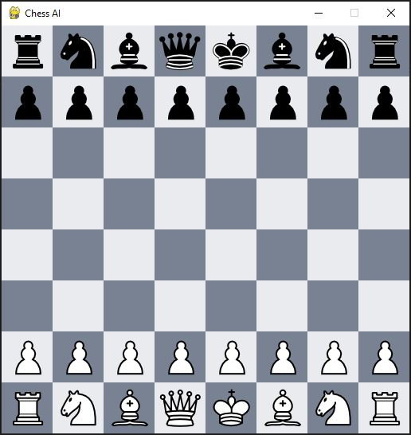
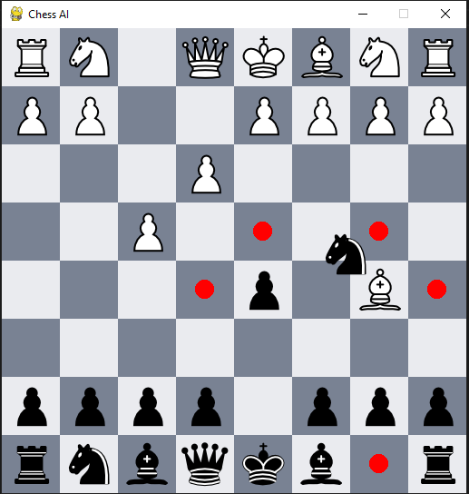

# Chess AI Project (2022)


⚠️ This project is not finished yet ⚠️

## Overview

This Python project implements a Chess-playing AI using the Minimax algorithm. The chess game itself is coded from scratch using the Pygame library. The goal is to provide an interactive and challenging chess-playing experience against an AI opponent.

## Dependencies

To install the required dependencies, run the following command:

pip install -r requirements.txt

css

```bash
This will ensure that all the necessary packages are installed to run the project successfully.
```

## How to Play

To launch the chess game, execute the following command:

```bash
python main.py
```

This will start the game, and you can play against the AI opponent. The AI is powered by the Minimax algorithm, which ensures strategic decision-making for the computer player.

If you want to play a regular two-player chess game, open `main.py` and replace the following line:

```python
game = Game(screen, AI=True)
```

with : 

```python
game = Game(screen, AI=False)
```

## Gameplay Instructions

- Use the mouse to click and drag chess pieces to make moves.
- The legal moves for each piece are highlighted when you click on a piece.
- The AI will respond with its move after each player's turn.
- The game continues until checkmate or a draw is achieved.

## Screenshots

<p align="center">
	
</p>

<p align="center">
	
</p>


Enjoy playing chess against the AI! Feel free to customize and extend the project as needed. If you encounter any issues or have suggestions for improvement, please don't hesitate to reach out.

## Credits

This project was developed by Guillaume DI FATTA. Feel free report issues, or provide feedback to make this chess-playing AI even better.
